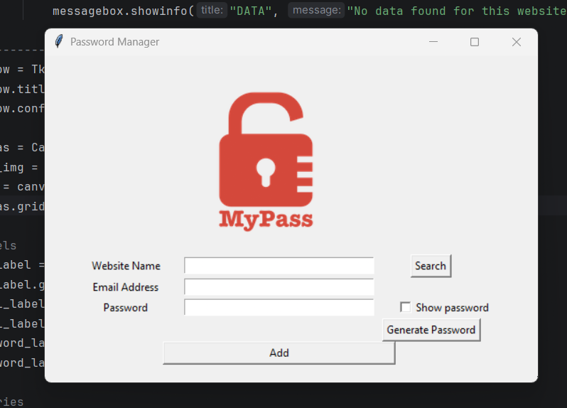

# Password Manager

A desktop password manager built with Python and Tkinter that allows users to generate, store, search, and manage website credentials through a simple graphical interface.

✨ Features

- 🔑 Generate random passwords
- 💾 Store website credentials locally
- 🔍 Search for saved credentials
- 📋 Copy passwords to clipboard
- 👁️ Show/hide password
- ⚠️ Prevent accidental overwriting
- 🛡️ Input validation and error handling

🛠️ Technologies Used

- Python
- Tkinter
- JSON
- Pyperclip

## 🚀 How to Run

1. Clone the repository

2. Install the required dependency:

```bash
pip install pyperclip
```

3. Run the application:

```bash
python main.py
```

## Preview



## What I Learned

- Building GUI applications with Tkinter
- Working with JSON and file handling
- Password generation
- Clipboard integration
- Exception handling
- User input validation

## Security Note

Credentials are stored locally in a JSON file. The actual `data.json` file is excluded from this repository using `.gitignore` and should not be committed when it contains real passwords.